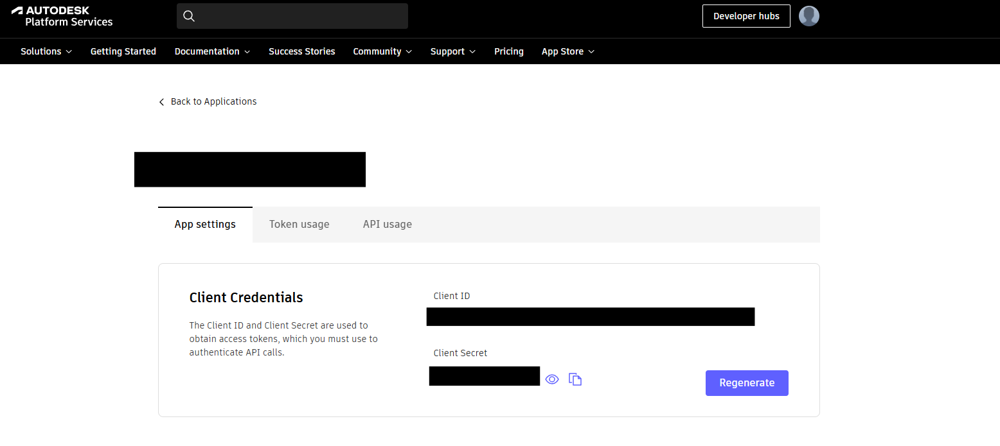
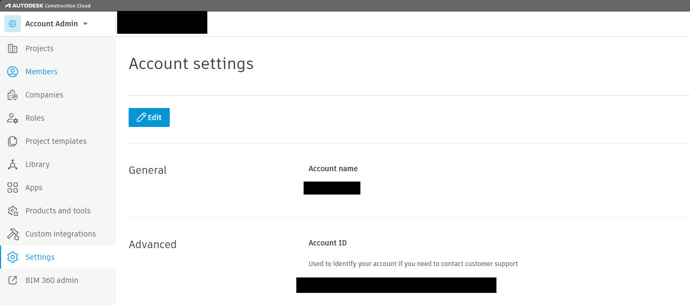
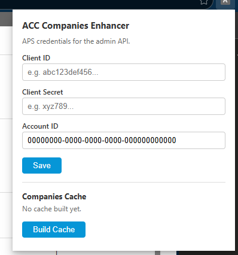

# ACC Supercharger

Chrome extension (MV3) that enhances the [Autodesk Construction Cloud](https://acc.autodesk.com) Admin interface with additional features and data overlays powered by the [APS (Autodesk Platform Services)](https://aps.autodesk.com) REST APIs.

## Features

- Adds member and project counts to the Companies sidebar
- Clickable counts that drill down into detailed member/project lists
- Background caching of companies, projects, and users for fast lookups
- Auto-refreshes cached data when stale (> 2 hours)

## Installation

No build step required.

1. Clone or download this repository
2. Open Chrome and navigate to `chrome://extensions`
3. Enable **Developer mode** (toggle in the top-right)
4. Click **Load unpacked** and select the repository folder

## Setup — APS Credentials

The extension needs three values to authenticate with the Autodesk Platform Services API: a **Client ID**, a **Client Secret**, and your **Account ID**.

### 1. Get your Client ID and Client Secret

1. Go to the [APS Developer Portal](https://aps.autodesk.com/myapps/) and sign in
2. Create a new application (or open an existing one)
3. Under **App settings → Client Credentials**, copy the **Client ID** and **Client Secret**



### 2. Get your Account ID

1. Go to [ACC Account Admin](https://acc.autodesk.com) and sign in as an account admin
2. Navigate to **Settings** in the left sidebar
3. Scroll down to the **Advanced** section — your **Account ID** is displayed there



### 3. Enter credentials in the extension

1. Click the extensions puzzle icon in Chrome and select **ACC Supercharger**


2. Enter your **Client ID**, **Client Secret**, and **Account ID**, then click **Save**
3. Click **Build Cache** to fetch and cache your account data



## File Structure

```
├── manifest.json          MV3 manifest (permissions: storage, alarms)
├── background.js          Service worker; data pipeline and cache orchestration
├── content.js             Content script injected on acc.autodesk.com
├── content.css            Styles for injected UI elements
├── api.js                 High-level API orchestration for content scripts
├── popup.html / popup.js  Extension popup (credentials + cache management)
├── options.html / options.js  Settings page (APS credentials)
├── pageScript.js          Script injected into the page context
└── lib/                   Reusable API modules (loaded as content scripts)
    ├── aps-constants.js   Shared APS endpoint URLs and constants
    ├── cache-builder.js   Caching layer for API responses
    ├── companies-api.js   Companies endpoint calls
    ├── projects-api.js    Projects endpoint calls
    └── users-api.js       Users endpoint calls
```

## Permissions

- **`storage`** — Persist APS credentials and cached data
- **`alarms`** — Schedule periodic cache refreshes
- **Host permissions** — `acc.autodesk.com` (content script injection), `developer.api.autodesk.com` (APS API calls)

## License

[GPL-3.0](LICENSE)
